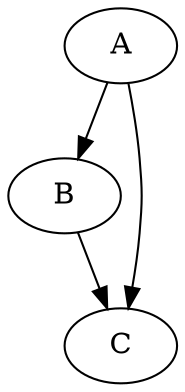
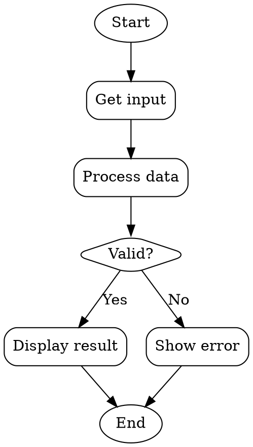
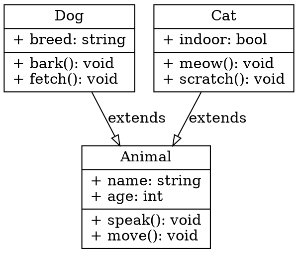
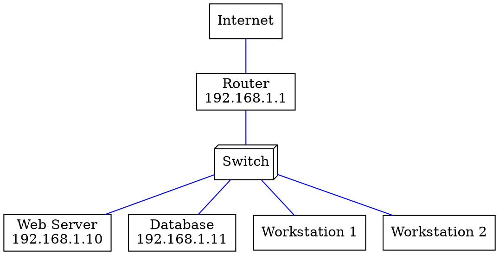
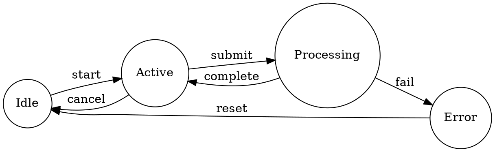
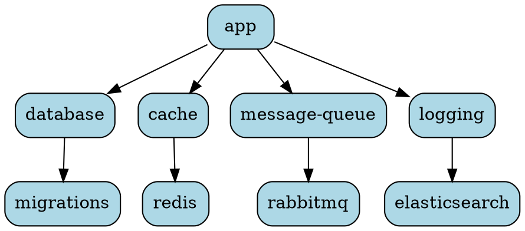

# Graphviz - Graph Visualization Software

Create diagrams and network graphs from text descriptions. Powerful layout algorithms for visualizing relationships and structures.

## Quick Start
```yaml
- preset: graphviz
```

## Features
- **DOT language**: Simple text-based graph description
- **Multiple layouts**: Hierarchical, radial, force-directed algorithms
- **Output formats**: PNG, PDF, SVG, PostScript
- **Programmable**: Generate diagrams from code
- **Node and edge styling**: Colors, shapes, fonts, arrows
- **Clustering**: Group related nodes together

## Basic Usage
```bash
# Create graph from DOT file
dot -Tpng input.dot -o output.png

# Generate SVG
dot -Tsvg input.dot -o output.svg

# Different layout engines
dot -Tpng graph.dot -o output.png      # Hierarchical
neato -Tpng graph.dot -o output.png    # Spring model
circo -Tpng graph.dot -o output.png    # Circular
fdp -Tpng graph.dot -o output.png      # Force-directed
twopi -Tpng graph.dot -o output.png    # Radial

# View available formats
dot -Thelp
```

## Advanced Configuration
```yaml
- preset: graphviz
  with:
    state: present
```

## Parameters
| Parameter | Type | Default | Description |
|-----------|------|---------|-------------|
| state | string | present | Install or remove Graphviz |

## Platform Support
- ✅ Linux (apt, dnf, yum, pacman, zypper)
- ✅ macOS (Homebrew)
- ✅ Windows (Chocolatey, installer)

## Configuration
- **Binaries**: `dot`, `neato`, `fdp`, `sfdp`, `twopi`, `circo`
- **DOT files**: Plain text `.dot` or `.gv` files
- **Output formats**: PNG, PDF, SVG, PS, many more

## Real-World Examples

### Simple Directed Graph

```bash
dot -Tpng graph.dot -o graph.png
```

### Flowchart


### Class Diagram


### Network Topology


### State Machine


### Dependency Graph


### Styled Graph
```dot
digraph Styled {
    graph [bgcolor=white, fontname="Helvetica"];
    node [fontname="Helvetica", fontsize=12];
    edge [fontname="Helvetica", fontsize=10];

    subgraph cluster_0 {
        label="Frontend";
        style=filled;
        color=lightgrey;
        React; Vue; Angular;
    }

    subgraph cluster_1 {
        label="Backend";
        style=filled;
        color=lightblue;
        Node; Django; Rails;
    }

    React -> Node [color=red, penwidth=2.0];
    Vue -> Django [color=green];
    Angular -> Rails [color=blue];
}
```

## Agent Use
- Generate architecture diagrams from code
- Visualize dependencies in build systems
- Create flowcharts for documentation
- Render database schema diagrams
- Visualize state machines and workflows
- Generate network topology maps

## Troubleshooting

### Command not found
```bash
# Verify installation
which dot
dot -V

# Check all binaries
ls -l $(which dot | xargs dirname)

# Reinstall
brew reinstall graphviz  # macOS
sudo apt-get install --reinstall graphviz  # Ubuntu
```

### Large graphs not rendering
```bash
# Increase memory limit
ulimit -s unlimited

# Simplify graph
# - Reduce number of nodes
# - Use subgraphs for clustering
# - Try different layout engine

# Use sfdp for large graphs (scalable force-directed)
sfdp -Tpng large-graph.dot -o output.png
```

### Overlapping nodes
```bash
# Adjust spacing
digraph G {
    graph [ranksep=1.5, nodesep=1.0];
    // ... nodes and edges
}

# Try different layout
neato -Tpng graph.dot -o output.png
fdp -Tpng graph.dot -o output.png

# Manual positioning
node [pos="0,0!"];  # ! forces position
```

### Font errors
```bash
# List available fonts
fc-list

# Specify font explicitly
node [fontname="Arial"];

# Use built-in fonts
# Helvetica, Times-Roman, Courier
```

## Uninstall
```yaml
- preset: graphviz
  with:
    state: absent
```

## Resources
- Official docs: https://graphviz.org/documentation/
- DOT language: https://graphviz.org/doc/info/lang.html
- Gallery: https://graphviz.org/gallery/
- Node shapes: https://graphviz.org/doc/info/shapes.html
- Search: "graphviz examples", "dot language tutorial", "graphviz online"
